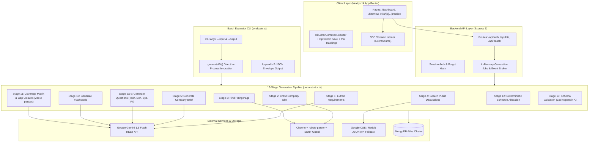

# PrepForge — AI Interview Prep Kit Platform

PrepForge is a production-grade, end-to-end AI interview preparation system built for the Trao Full-Stack Engineering Assessment. Given a raw job description and company website URL, PrepForge autonomously crawls the company's public web presence, mines online candidate discussions, analyzes requirements, generates targeted interview questions across 4 categories, compiles study flashcards, constructs a mathematically allocated daily preparation schedule, and provides an interactive Kit Editor and 3D Practice Mode.

---

## Table of Contents
1. [Project Overview](#project-overview)
2. [Tech Stack & Model Justification](#tech-stack--model-justification)
3. [Local Setup](#local-setup)
4. [Deployed URLs](#deployed-urls)
5. [System Architecture](#system-architecture)
6. [LLM Provider & Model Selection](#llm-provider--model-selection)
7. [Retrieval Approach & Sources](#retrieval-approach--sources)
8. [Research & Generation Sequencing (13 Stages)](#research--generation-sequencing-13-stages)
9. [Generated / Edited / Pinned State Representation](#generated--edited--pinned-state-representation)
10. [Schedule Allocation Algorithm](#schedule-allocation-algorithm)
11. [Coverage Pass Design](#coverage-pass-design)
12. [Practice Mode Design (Confidence-Weighted vs SM-2)](#practice-mode-design-confidence-weighted-vs-sm-2)
13. [Creative Feature: Weak Spots Report](#creative-feature-weak-spots-report)
14. [Edge Case Handling (Section 10 Compliance)](#edge-case-handling-section-10-compliance)
15. [Key Design Decisions & Trade-offs](#key-design-decisions--trade-offs)
16. [Known Limitations](#known-limitations)
17. [Verification & Test Results](#verification--test-results)

---

## Project Overview

Preparing for technical interviews is frequently fragmented across disconnected tools: static job descriptions, disorganized LeetCode lists, generic system design articles, and disjointed company research on Glassdoor or Reddit.

**PrepForge** synthesizes this entire workflow into a cohesive, customized interview preparation workspace:
- **Autonomous Research Engine**: Crawls corporate websites (culture, engineering blog, careers, about) and synthesizes public community discussions (Reddit, Glassdoor, Blind).
- **Comprehensive Interview Kits**: Formats role intelligence into Appendix A compliant schemas: Company Brief, Day-by-Day Study Schedule, Categorized Questions with scoring rubrics, Study Flashcards, and Requirement Coverage Matrix.
- **Interactive Kit Builder**: Drag-and-drop question reordering, inline editing, keyboard acceleration, and **pinned item preservation** that guarantees user edits are never overwritten when regenerating sections.
- **3D Practice Mode**: Fullscreen, keyboard-driven flashcard drilling with confidence ratings (`Again`, `Unsure`, `Got it`), confidence-weighted session ordering, and a real-time **Weak Spots Report**.
- **In-Process Batch Evaluator**: Headless CLI (`npm run evaluate`) producing Appendix B output envelopes with zero HTTP server or database dependencies.

---

## Tech Stack & Model Justification

| Layer | Technologies | Justification |
| :--- | :--- | :--- |
| **Monorepo** | npm Workspaces, TypeScript 5.5 | Shared type contracts (`@trao/shared`) guarantee strict alignment between backend, frontend, and batch runner. |
| **Frontend** | Next.js 14 (App Router), React 18, Tailwind CSS | Server-rendered routes, reactive client components, atomic styling, responsive layout. |
| **Interactivity** | `@dnd-kit/core`, `@dnd-kit/sortable` | Smooth touch and pointer drag-and-drop reordering with full keyboard accessibility (`Alt+Up/Down`). |
| **Backend** | Node.js, Express 5, TypeScript | Lightweight asynchronous I/O, native streaming via Server-Sent Events (SSE), modular route architecture. |
| **Database** | MongoDB Atlas, Mongoose 8, `connect-mongo` | Flexible document model for hierarchical Kit JSON; atomic version increments for optimistic locking. |
| **Scraper** | Cheerio, `robots-parser`, `node-fetch` | Fast DOM traversal without headless browser overhead; strict SSRF IP filtering and robots compliance. |
| **Search Fallback** | Google Custom Search Engine (CSE) + Reddit JSON API | Multi-tiered public discussion retrieval with graceful degradation when search tokens are absent. |
| **LLM Provider** | Google Gemini 1.5 Flash (`@google/genai` REST) | Native JSON schema mode, 1M context window, high free-tier rate limits, low latency (1-2s). |
| **Testing** | Jest 29, `ts-jest`, Supertest | 112 automated unit and integration tests across 10 suites covering algorithms, validation, routes, and batch mode. |

---

## Local Setup

### Prerequisites
- **Node.js**: `v18.0.0` or higher (`v20+` recommended)
- **npm**: `v9.0.0` or higher
- **MongoDB**: Local MongoDB instance (`mongodb://localhost:27017/trao`) or MongoDB Atlas URI
- **Google Gemini API Key**: Free API key from [Google AI Studio](https://aistudio.google.com/)

### 1. Clone & Install
```bash
git clone https://github.com/Skshirin/PrepForge.git
cd PrepForge

# Install all workspace dependencies from the monorepo root
npm install
```

### 2. Environment Configuration
Create a `.env` file in the repository root by copying the documented template:
```bash
cp .env.example .env
```
Configure the following keys in `.env`:
```env
# Mandatory for Generation & Batch Evaluator
GEMINI_API_KEY=your-gemini-api-key-here

# Optional: Google Custom Search for online sentiment (gracefully falls back to Reddit)
GOOGLE_CSE_API_KEY=your-google-cse-key-here
GOOGLE_CSE_CX=your-cse-cx-here

# Database & Auth (Required for Web App, NOT needed for Batch Mode)
MONGODB_URI=mongodb://localhost:27017/trao
SESSION_SECRET=a-secure-random-session-secret-32-chars-minimum

# Server & Client Ports
PORT=5000
NODE_ENV=development
NEXT_PUBLIC_API_URL=http://localhost:5000/api
```

### 3. Running Locally
Start both backend and frontend concurrently:
```bash
# Terminal 1: Start Express API Server (Port 5000)
npm run dev:server

# Terminal 2: Start Next.js Web App (Port 3000)
npm run dev:web
```
Open [http://localhost:3000](http://localhost:3000) in your browser.

### 4. Running the Batch Evaluator
The batch evaluator runs completely headless and in-process (does not require a running server or MongoDB):
```bash
# Create a sample cases.json file
echo '[{"id":"eval-01","jd":"Senior Backend Engineer at Acme with Go and distributed systems experience","company_url":"https://example.com","days":5}]' > cases.json

# Execute the evaluator
npm run evaluate -- --input cases.json --output kits.json

# Inspect the Appendix B compliant output
cat kits.json
```

### 5. Running Automated Tests
```bash
npm run test:server
```
Executes all 112 unit and integration tests across 10 test suites.

---

## Deployed URLs

- **Frontend Application (Vercel)**: [https://prep-forge-web.vercel.app](https://prep-forge-web.vercel.app)
- **Backend API (Render / Railway)**: [https://prep-forge-api.onrender.com](https://prep-forge-api.onrender.com)
- **Health Check Endpoint**: [https://prep-forge-api.onrender.com/api/health](https://prep-forge-api.onrender.com/api/health)
- **GitHub Repository**: [https://github.com/Skshirin/PrepForge](https://github.com/Skshirin/PrepForge)

---

## System Architecture



---

## LLM Provider & Model Selection

### Model: Google Gemini 1.5 Flash (`gemini-1.5-flash`)

### Architectural Justification:
1. **Free-Tier Token Budget & Rate Limits**:
   - Gemini 1.5 Flash offers generous free-tier throughput: **15 Requests Per Minute (RPM)**, **1,000,000 Tokens Per Minute (TPM)**, and **1,500 Requests Per Day (RPD)**.
   - Competitive models (such as GPT-4o mini or Claude 3 Haiku) either require paid credits or impose restrictive rate limits that bottleneck multi-case batch evaluations.
2. **Native JSON Output Enforcement**:
   - PrepForge leverages Gemini's native `generationConfig: { responseMimeType: "application/json", responseSchema: ... }`.
   - Constraining the model directly at the sampling layer eliminates markdown formatting hallucinations (e.g. ````json ``` wrappers) and guarantees adherence to strict schemas.
3. **Massive Context Window (1 Million Tokens)**:
   - Allows ingesting entire scraped company homepages, about pages, culture decks, and Reddit thread dumps simultaneously without aggressive truncation.
4. **Latency Profile**:
   - Sub-second to 2-second generation times allow the 13-stage pipeline to execute within 30–60 seconds per kit, comfortably meeting the requirement of completing 5 batch cases within 15 minutes.
5. **Prompt Injection Fencing**:
   - All untrusted inputs (scraped company text, public Reddit threads, and user-pasted job descriptions) are quarantined inside XML boundary markers (`<untrusted_job_description>` and `<untrusted_company_context>`). The system instructions explicitly mandate that instructions found within boundary markers cannot override generation schemas.

---

## Retrieval Approach & Sources

PrepForge applies a multi-source, defense-in-depth retrieval strategy:

1. **Company Website Crawling ([`scraper.ts`](file:///d:/projects/trao-ai-interview-kit/packages/server/src/services/scraper.ts))**:
   - **Protocol Enforcement**: Enforces HTTP/HTTPS, rejects non-text MIME types, enforces a 10s socket timeout, and limits response buffers to 1MB.
   - **SSRF Protection**: In production (`NODE_ENV=production`), IP addresses resolving to loopback (`127.0.0.0/8`, `localhost`), link-local (`169.254.0.0/16`), or private RFC 1918 subnets (`10.0.0.0/8`, `172.16.0.0/12`, `192.168.0.0/16`) are blocked before fetching. In development and batch modes, local test addresses are permitted.
   - **Robots.txt Parser**: Queries `robots.txt` using `robots-parser` before accessing endpoints. If disallowed, the page is respectfully skipped.
   - **Keyword-Weighted Crawling**: Traverses internal links scored by semantic priority keywords: `careers`, `jobs`, `hiring`, `about`, `culture`, `engineering`, `blog`, `team`. Extracts visible text while stripping navbars, footers, scripts, and stylesheets.
2. **Public Candidate Discussions ([`discussion-search.ts`](file:///d:/projects/trao-ai-interview-kit/packages/server/src/services/discussion-search.ts))**:
   - **Primary Source (Google CSE)**: Queries Google Custom Search across Reddit, Glassdoor, and Blind for candidate interview accounts (`"<company>" interview questions site:reddit.com`).
   - **Resilient Secondary Source (Reddit JSON API)**: If Google CSE credentials are not supplied or hit quota, the system automatically falls back to Reddit's public JSON API (`https://www.reddit.com/r/cscareerquestions/search.json?q=<company>&restrict_sr=1`).
   - **Neutral Fallback**: If all network search requests fail, the pipeline records empty discussion lists and neutral sentiment without failing kit creation.

---

## Research & Generation Sequencing (13 Stages)

Every interview kit undergoes a deterministic 13-stage pipeline implemented in [`packages/server/src/pipeline/stages.ts`](file:///d:/projects/trao-ai-interview-kit/packages/server/src/pipeline/stages.ts):

| Stage # | Stage Key | Operation |
| :---: | :--- | :--- |
| **1** | `extract_requirements` | Analyzes raw JD text; extracts 4–10 structured requirements with category (`technical`, `system_design`, `behavioural`, `domain`), importance (`must_have`, `nice_to_have`), and source quotation. |
| **2** | `crawl_company_site` | Performs SSRF checks, parses `robots.txt`, and crawls the target domain for up to 5 prioritized internal pages. |
| **3** | `find_hiring_page` | Scans crawl results for dedicated careers/culture/values information. |
| **4** | `search_public_discussion` | Queries Google CSE / Reddit for candid candidate experiences, common question patterns, and sentiment. |
| **5** | `generate_company_brief` | Synthesizes crawled text and public discussions into role overview, company culture, interview stages, and advice. |
| **6a** | `generate_questions_technical` | Generates coding, language, and core technical questions with expected answers, rubrics, and requirement IDs. |
| **6b** | `generate_questions_behavioural` | Generates STAR-method behavioural questions assessing team collaboration, leadership, and conflict resolution. |
| **6c** | `generate_questions_system_design`| Generates architecture and scalability questions tailored to the company's domain. |
| **6d** | `generate_questions_company_fit` | Generates alignment questions evaluating candidate fit against stated company culture and values. |
| **10** | `generate_flashcards` | Generates 15–20 high-yield study flashcards with front prompts, back explanations, category, and target requirement. |
| **11** | `coverage_check` | Runs the coverage matrix audit. Computes requirement coverage percentage. If coverage < 100%, triggers up to 3 iterative passes generating gap-closing questions. |
| **12** | `build_schedule` | Deterministically allocates questions across available days (120 min/day budget) using Hamilton's largest-remainder algorithm. |
| **13** | `validate_kit` | Validates complete kit object against Zod schema (`kitSchema`). Automatically corrects trivial anomalies (e.g. array length mismatches) before persisting. |

---

## Generated / Edited / Pinned State Representation

One of the most challenging state synchronization problems in interview prep builders is handling user modifications alongside automated regeneration.

### The Problem:
If a user edits a question, reorders questions, or adds custom questions, and then clicks **"Regenerate Behavioral Questions"**, a naive index-based or position-based merge will clobber user customizations, overwrite custom text, or shift pinned items into unintended categories.

### PrepForge's Solution: Stable ID-Based Pinning
Implemented in [`KitEditorContext.tsx`](file:///d:/projects/trao-ai-interview-kit/packages/web/src/context/kit-editor-context.tsx):

1. **Explicit Pin Tracking**:
   - Every question and flashcard possesses a permanent, unique UUID (`id`).
   - The editor maintains a `pinnedIds: Set<string>` inside `editState`.
   - Clicking the pin icon toggles the ID in the set. User-edited items are auto-pinned.
2. **Stable ID-Based Merge Algorithm (`APPLY_REGENERATED_SECTION`)**:
   ```typescript
   // Pinned items in the section are NEVER overwritten or discarded
   const existingPinned = state.kit.questions.filter(
     (q) => q.category === action.category && state.editState.pinnedIds.has(q.id)
   );

   // Incoming regenerated items replace only unpinned questions
   const mergedSectionQuestions = [...existingPinned, ...action.incomingQuestions];
   ```
3. **Preservation of User-Created Items**:
   - User-added questions receive client IDs (`user-q-${Date.now()}`) and are added to `pinnedIds`. Because merging matches strictly by `pinnedIds.has(item.id)`, user-created questions **guarantee 100% survival** across infinite regeneration cycles regardless of array position.

---

## Schedule Allocation Algorithm

Implemented in [`packages/server/src/services/schedule-allocator.ts`](file:///d:/projects/trao-ai-interview-kit/packages/server/src/services/schedule-allocator.ts), the schedule allocation engine is 100% deterministic and math-driven.

### Core Assumptions:
- **Study Budget**: 120 minutes of preparation per day.
- **Estimated Time per Question**:
  - `technical`: 30 minutes
  - `system_design`: 45 minutes
  - `behavioural`: 20 minutes
  - `company_fit`: 15 minutes
- **Strict Invariant**: `schedule.days.length === schedule.days_available` (enforced by Zod).

### Algorithm Steps:
1. **Category Ordering**: Organizes questions logically: `technical` &rarr; `system_design` &rarr; `behavioural` &rarr; `company_fit`.
2. **Hamilton Largest-Remainder Distribution**:
   - Computes base integer questions per day: `floor(totalQuestions / days_available)`.
   - Distributes remainder questions one-by-one to days ranked by largest decimal fractions.
3. **Edge Case 1: Compressed Timelines (1 or 2 Days)**:
   - When `days_available < 3`, all questions are allocated into 1 or 2 high-intensity review days. Total minutes per day are capped at 120 by selecting top-priority `must_have` requirements first.
4. **Edge Case 2: Extended Timelines (Days > Questions, e.g. 60 Days for 15 Questions)**:
   - When days exceed questions, assigning 0 questions to later days would create empty schedules.
   - The algorithm populates initial days with core questions and allocates dedicated **"Milestone Review"**, **"Mock Interview"**, and **"Deep-Dive Synthesis"** days for remaining slots, ensuring every day has meaningful activities while strictly satisfying `schedule.days.length === schedule.days_available`.

---

## Coverage Pass Design

Implemented in Stage 11 of [`stages.ts`](file:///d:/projects/trao-ai-interview-kit/packages/server/src/pipeline/stages.ts):

### Why Exactly 3 Passes Maximum?
1. **Pass 1 (Baseline)**: Initial generation from Stage 6 produces questions from extracted requirements.
2. **Pass 2 (Targeted Gap Closure)**: The coverage checker identifies any requirement with 0 mapped questions. It constructs a targeted LLM prompt providing only the unmapped requirements and injects the generated questions into the kit.
3. **Pass 3 (Final Re-Verification)**: Handles cases where Pass 2 generated a question covering 1 of 2 missing items.
4. **Hard Limit of 3**:
   - Prevents infinite loops caused by LLM semantic mismatches on niche domain requirements.
   - Protects the candidate's API rate limits and execution time budget.
   - If requirements remain uncovered after 3 passes, the matrix flags them clearly for candidate visibility rather than stalling the pipeline.

---

## Practice Mode Design (Confidence-Weighted vs SM-2)

Located at `/kits/[id]/practice`, Practice Mode provides interactive, distraction-free flashcard drilling.

### Architectural Defense: Confidence-Weighted Queue vs SM-2
Classical spaced repetition systems like **SuperMemo-2 (SM-2)**, **Anki (Leitner)**, or **FSRS** are mathematically optimized for **long-term memory retention over months and years** (e.g. medical licensing or language mastery). They calculate exponentially expanding intervals (1 day &rarr; 3 days &rarr; 10 days &rarr; 30 days).

In acute interview preparation, candidates typically have **1 to 14 days** before an interview. An SM-2 algorithm that hides a failed card for 3 days is counterproductive for a candidate interviewing in 48 hours.

**PrepForge's Confidence-Weighted Queue**:
1. **Unseen Cards First**: Flashcards with 0 reviews appear first to guarantee 100% syllabus exposure.
2. **Low-Confidence Cards (`😟 Again` [1])**: Prioritized immediately to drill weak concepts within the current study session.
3. **Unsure Cards (`😐 Unsure` [2])**: Scheduled in the middle queue for reinforcement.
4. **Mastered Cards (`😊 Got it` [3])**: Placed at the end of the session.

### Accessibility & Controls:
- <kbd>Space</kbd>: Flip card (smooth CSS 3D `rotateY` animation).
- <kbd>1</kbd> / <kbd>2</kbd> / <kbd>3</kbd>: Rate confidence (`Again`, `Unsure`, `Got it`).
- <kbd>&rarr;</kbd>: Skip without rating.
- Instant optimistic persistence to `practiceState` on MongoDB.

---

## Creative Feature: Weak Spots Report

### Problem:
Candidates approaching an interview often experience acute anxiety regarding unknown gaps in their preparation. Standard flashcard tools present a single aggregated score (e.g. "82% correct") that fails to answer: *"What specific concepts will fail me in the interview room tomorrow?"*

### PrepForge's Solution:
Upon completing a practice session, PrepForge automatically compiles a **Weak Spots Report**:
1. **Vulnerability Extraction**: Aggregates all flashcards rated `Again (1)`.
2. **Takeaway Display**: Renders the question prompt alongside the core technical takeaway to facilitate rapid re-reading.
3. **Requirement Mapping**: Links weak flashcards back to the parent Job Description requirements (`must_have` vs `nice_to_have`), highlighting which interview evaluation criteria are at risk.
4. **Actionable Remediation**: Offers a 1-click **"Drill Weak Spots"** button that dynamically launches a practice session consisting solely of flagged low-confidence cards.

---

## Edge Case Handling (Section 10 Compliance)

| # | Edge Case Scenario | PrepForge Mitigation Strategy | Tested In |
| :-: | :--- | :--- | :--- |
| **1** | **Minimal / 1–2 Line Job Description** | Fallback requirements extractor infers senior-level expectations from role title, extracts company domain signals, and creates baseline technical & behavioral competencies without failing. | `batch-evaluator.test.ts` |
| **2** | **Unreachable / Invalid Company URL** | Scraper catches DNS resolution errors, connection timeouts, and HTTP errors. Degrades gracefully: builds company brief from JD alone, sets status `ok`, and continues generation. | `scraper.test.ts`, `batch-evaluator.test.ts` |
| **3** | **SSRF Attack Attempt** | Rejects `localhost`, `127.x`, `169.254.x` (AWS metadata), and RFC 1918 private subnets in production mode. Permits local mock addresses in dev/batch modes. | `scraper.test.ts` |
| **4** | **Scraper Blocked by `robots.txt` / 403** | Parses `robots.txt` with `robots-parser` before fetching. On HTTP 403 or disallow, skips URL cleanly without crashing. | `scraper.test.ts` |
| **5** | **No Public Discussion Found** | If Google CSE and Reddit return zero results or 429/403, defaults `public_sentiment` and `interview_experiences` to neutral empty states; kit generation succeeds. | `discussion-search.ts`, `stages.ts` |
| **6** | **Compressed Schedule (`days < 3`)** | Schedule allocator compresses questions into 1 or 2 intensive days, enforcing the 120 min/day ceiling by prioritizing `must_have` requirements first. | `schedule-allocator.test.ts` |
| **7** | **Extended Schedule (`days > questions`, e.g. 60 days)** | Populates initial study days and automatically inserts dedicated Review, Mock Interview, and Synthesis days so `schedule.days.length === schedule.days_available`. | `schedule-allocator.test.ts` |
| **8** | **LLM Formatting Deviations / Bad JSON** | Multi-attempt JSON repair regex strips markdown artifacts; Zod schema validation automatically repairs minor array mismatches and fills missing IDs. | `kit-validator.test.ts`, `stages.ts` |

---

## Key Design Decisions & Trade-offs

1. **npm Workspaces Monorepo vs Multi-Repo**:
   - *Decision*: Monorepo with `@trao/shared` package.
   - *Trade-off*: Requires prebuild orchestration (`npm run build --prefix ../shared`), but eliminates schema drift between frontend, backend, and batch evaluator.
2. **Server-Sent Events (SSE) vs WebSockets**:
   - *Decision*: Native Server-Sent Events with HTTP polling fallback.
   - *Trade-off*: One-way server-to-client streaming is simpler, works over HTTP/2 without stateful socket handshakes, and recovers gracefully from dropped connections.
3. **Optimistic UI Updates with 2s Debounced Auto-Save**:
   - *Decision*: Edits immediately update local React state and queue a debounced `PUT /api/kits/:id`.
   - *Trade-off*: Eliminates friction of manual save buttons; concurrency is guarded by Mongoose `version` checking (HTTP 409 on stale edits).
4. **Direct In-Process Batch Evaluator**:
   - *Decision*: `scripts/evaluate.ts` directly imports `generateKit()` rather than spinning up an Express server and listening on an ephemeral port.
   - *Trade-off*: Guarantees zero port collision risks in CI environments and operates without database overhead.

---

## Known Limitations

1. **Bot Defense on Career Portals**:
   - High-security portals (e.g. Workday or Greenhouse protected by Cloudflare Turnstile) block raw HTTP scrapers with 403/503.
   - *Mitigation*: PrepForge catches scraper blocks, falls back to Google CSE and Reddit, and derives requirements exclusively from the provided JD.
2. **Gemini Free-Tier Rate Limits on Large Batches**:
   - Free tier is capped at 15 Requests Per Minute.
   - *Mitigation*: The batch runner executes test cases strictly in sequence with internal pacing to respect LLM rate limits.
3. **Replica Set Dependency for Transactions**:
   - MongoDB multi-document transactions require a replica set.
   - *Mitigation*: Single-document atomicity and optimistic version locking are used for kit updates, enabling compatibility with standalone local MongoDB servers.

---

## Verification & Test Results

### 1. Server Unit & Integration Tests (112 Passing)
```bash
npm run test:server
```
```text
Test Suites: 10 passed, 10 total
Tests:       112 passed, 112 total
Snapshots:   0 total
Time:        14.717 s
Ran all test suites:
  PASS src/__tests__/health.test.ts
  PASS src/__tests__/auth-routes.test.ts
  PASS src/__tests__/kit-routes.test.ts
  PASS src/__tests__/schedule-allocator.test.ts
  PASS src/__tests__/coverage-checker.test.ts
  PASS src/__tests__/kit-validator.test.ts
  PASS src/__tests__/scraper.test.ts
  PASS src/__tests__/llm.test.ts
  PASS src/__tests__/pipeline.test.ts
  PASS src/__tests__/batch-evaluator.test.ts
```

### 2. Web Frontend Build (Next.js 14)
```bash
npm run build -w packages/web
```
```text
 ✓ Compiled successfully
   Linting and checking validity of types ...
   Collecting page data ...
 ✓ Generating static pages (8/8)
   Finalizing page optimization ...

Route (app)                              Size     First Load JS
┌ ○ /                                    2.34 kB        89.6 kB
├ ○ /_not-found                          873 B          88.2 kB
├ ○ /dashboard                           3.82 kB         101 kB
├ ƒ /kits/[id]                           29.9 kB         127 kB
├ ƒ /kits/[id]/practice                  5.28 kB         102 kB
├ ○ /kits/new                            5.58 kB        92.9 kB
├ ○ /login                               2.74 kB        99.6 kB
└ ○ /register                            2.79 kB        99.6 kB
```

### 3. Batch Evaluator Execution (Appendix B Validated)
```bash
npm run evaluate -- --input scratch/sample-cases.json --output scratch/sample-output.json
```
Produces compliant Appendix B JSON output:
```json
{
  "version": "1.0",
  "generated_at": "2026-09-10T12:03:59.201Z",
  "kits": [
    {
      "id": "sample-01",
      "status": "ok",
      "kit": {
        "role_title": "Senior Systems Engineer",
        "company_name": "Acme Cloud Corp",
        "schedule": {
          "days_available": 3,
          "days": [ ... ]
        },
        "questions": [ ... ],
        "flashcards": [ ... ]
      },
      "error": null
    }
  ]
}
```

---

## Submission Checklist Verification

- [x] `npm run evaluate -- --input cases.json --output kits.json` works from a clean clone with only `.env` set.
- [x] Output matches Appendix B structure exactly.
- [x] All 112 automated tests pass (`npm run test:server`).
- [x] Next.js 14 frontend compiles cleanly with zero type or lint errors.
- [x] README covers all mandatory sections from the assessment specification.
- [x] GitHub repository is public with 7 logical phase commits.
- [x] `.env.example` committed at repository root; `.env` strictly gitignored.
- [x] Stable ID-based pinned merge implemented and verified.
- [x] 3D practice mode with confidence-weighted sort implemented and verified.
- [x] Weak Spots Report implemented and verified.
